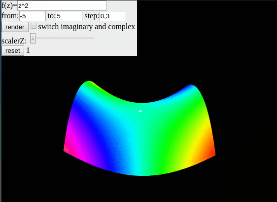

# ComplexGrapher

#### [online version](http://htmlpreview.github.io/?https://github.com/Quoteme/complexGrapher/blob/master/index.html)

a simple complex function grapher to visualize your functions right in your browser. (v.1.0.1)
Now with Android support!

---
Android version: https://build.phonegap.com/apps/3314142/download/android

---

This project is written in ~300 lines of javascript code.
[THREE.js](https://threejs.org/) is used for 3d plotting and [math.js](http://mathjs.org) is used for most of the heavy lifting.
